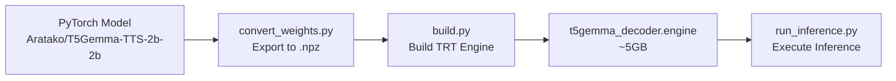

# TensorRT-LLM Implementation Guide for T5Gemma-TTS

Tài liệu hướng dẫn chi tiết cách chạy TensorRT-LLM implementation cho T5Gemma-TTS decoder.

> [!WARNING]
> **Trạng thái hiện tại (2026-01-05)**: Implementation đang trong quá trình debug. RoPE đã được tạm thời disable để isolate vấn đề NaN output. Xem [Known Issues](#known-issues) để biết thêm chi tiết.

---

## Mục lục

1. [Tổng quan](#tổng-quan)
2. [Yêu cầu hệ thống](#yêu-cầu-hệ-thống)
3. [Cấu trúc thư mục](#cấu-trúc-thư-mục)
4. [Hướng dẫn từng bước](#hướng-dẫn-từng-bước)
5. [Model Configuration](#model-configuration)
6. [Files Reference](#files-reference)
7. [Known Issues](#known-issues)
8. [Troubleshooting](#troubleshooting)

---

## Tổng quan

Implementation này convert **T5Gemma-TTS decoder** từ PyTorch sang TensorRT-LLM để tối ưu inference performance. 

### Architecture Overview



### Components

| Component | Mô tả |
|-----------|-------|
| **Encoder** | T5 encoder (chưa được implement trong TRT) |
| **Decoder** | 26 layers với Self-Attention + Cross-Attention + MLP |
| **RoPE** | Standard RoPE cho self-attn, PM-RoPE cho cross-attn |
| **Audio Embedding** | vocab_size = 65541 (65536 audio tokens + 5 special) |

---

## Yêu cầu hệ thống

### Hardware
- **GPU**: NVIDIA GPU với VRAM ≥ 16GB (khuyến nghị 24GB+)
- **RAM**: ≥ 32GB 
- **Storage**: ≥ 20GB cho engine và weights

### Software
- **Docker**: Docker Engine với NVIDIA Container Toolkit
- **CUDA**: Compatible với TensorRT-LLM image (CUDA 12.x)

---

## Cấu trúc thư mục

```
T5Gemma-TTS/
├── tensorrt_llm_implementation/
│   ├── Dockerfile              # Base image: nvcr.io/nvidia/tensorrt-llm/release:1.2.0rc6
│   ├── docker-compose.yml      # Docker compose config
│   ├── modeling.py             # TRT-LLM model definition
│   ├── build.py                # Engine builder script
│   ├── convert_weights.py      # PyTorch → .npz converter
│   ├── run_inference.py        # Inference script
│   └── compare_with_pytorch.py # Validation script
├── trt_weights/
│   └── weights.npz             # Converted weights (~4GB)
└── engine_output/
    └── t5gemma_decoder.engine  # Built TRT engine (~5GB)
```

---

## Hướng dẫn từng bước

### Step 1: Pull Docker Image

```bash
# Pull TensorRT-LLM image (nếu chưa có)
docker pull nvcr.io/nvidia/tensorrt-llm/release:1.2.0rc6
```

### Step 2: Convert Weights từ PyTorch

```bash
cd T5Gemma-TTS

# Activate Python environment với PyTorch
source .venv/bin/activate

# Convert weights từ HuggingFace model
python tensorrt_llm_implementation/convert_weights.py \
    --model_name "Aratako/T5Gemma-TTS-2b-2b" \
    --output_dir trt_weights
```

> [!NOTE]
> Quá trình này sẽ tải model từ HuggingFace và convert sang format `.npz`. Cần ~16GB RAM.

**Output**: `trt_weights/weights.npz`

### Step 3: Build TensorRT Engine

```bash
cd tensorrt_llm_implementation

# Build Docker image và chạy engine builder
docker compose run --rm builder python3 build.py \
    --weights_path ../trt_weights/weights.npz \
    --output_dir ../engine_output
```

**Thời gian build**: ~5-10 phút (tùy GPU)

**Output**: `engine_output/t5gemma_decoder.engine`

### Step 4: Run Inference

```bash
# Chạy inference test
docker compose run --rm builder python3 run_inference.py \
    --engine_dir ../engine_output
```

---

## Model Configuration

### Correct Config Values (Fixed from debugging session)

```python
class T5Config:
    vocab_size = 65541          # Audio tokens (65536 + 5 special)
    hidden_size = 2304
    d_kv = 256                  # head_dim - CRITICAL!
    d_ff = 9216
    num_decoder_layers = 26
    num_attention_heads = 8     # Q heads
    num_kv_heads = 4            # K/V heads (GQA)
    rms_norm_eps = 1e-6
    rope_theta = 10000.0
```

> [!CAUTION]
> **Config sai trước đây đã gây ra NaN output:**
> - `d_kv = 64` ❌ → Phải là `256` ✅
> - `num_attention_heads = 32` ❌ → Phải là `8` ✅
> - `num_kv_heads = 16` ❌ → Phải là `4` ✅

### Weight Dimensions Verification

| Weight | Expected Shape |
|--------|----------------|
| `layers.*.self_attn.q.weight` | (2048, 2304) |
| `layers.*.self_attn.k.weight` | (1024, 2304) |
| `layers.*.self_attn.v.weight` | (1024, 2304) |
| `audio_embedding.weight` | (65541, 2304) |

---

## Files Reference

### [modeling.py](file:///hdd/chungha/hdd-data/Mazii_AI-casual-TTS/T5Gemma-TTS/tensorrt_llm_implementation/modeling.py)

Định nghĩa TRT-LLM model structure:

- `T5GemmaDecoderTRT`: Main decoder module
- `T5GemmaBlock`: Single decoder layer (SA + CA + MLP)
- `T5GemmaAttention`: Attention với GQA support
- `GemmaMLP`: SwiGLU MLP block
- `apply_rope_fixed()`: Standard RoPE cho self-attention
- `apply_pm_rope()`: Progress-Monitoring RoPE cho cross-attention

### [build.py](file:///hdd/chungha/hdd-data/Mazii_AI-casual-TTS/T5Gemma-TTS/tensorrt_llm_implementation/build.py)

Engine builder với:
- Fixed shapes: `BATCH=1, DEC_SEQ=32, ENC_SEQ=64`
- Weight loading với key mapping
- Low optimization level để giảm memory usage

### [convert_weights.py](file:///hdd/chungha/hdd-data/Mazii_AI-casual-TTS/T5Gemma-TTS/tensorrt_llm_implementation/convert_weights.py)

Weight converter với key mapping:
- `backbone.model.decoder.layers.X.*` → `layers.X.*`
- `audio_embedding.0.weight` → `audio_embedding.weight`
- Skip `embed_tokens` (text embedding - không dùng cho TTS)

### [docker-compose.yml](file:///hdd/chungha/hdd-data/Mazii_AI-casual-TTS/T5Gemma-TTS/tensorrt_llm_implementation/docker-compose.yml)

Docker configuration:
- `shm_size: 16gb` - Tăng shared memory cho TRT build
- `TRT_LLM_ENABLE_XQA=0` - Disable XQA để giảm memory
- Mount `../` vào `/app` để access weights

---

## Known Issues

### 1. NaN Output Problem (Current)

**Status**: 🔴 Đang debug

**Symptom**: Output tensor toàn NaN values

**Root Cause Investigation**:
1. ✅ Config đã fix (head_dim, num_heads sai)
2. ⏳ RoPE implementation đang được tạm disable
3. ⏳ Cần so sánh output từng block với PyTorch

**Workaround hiện tại**: RoPE đã được comment out trong `modeling.py` để isolate vấn đề.

### 2. Memory Issues

Build engine có thể fail nếu thiếu VRAM. Solutions:
- Dùng `opt_level=0` trong `build.py`
- Tăng `shm_size` trong docker-compose
- Set `TRT_LLM_ENABLE_XQA=0`

---

## Troubleshooting

### Engine build fails với OOM

```bash
# Tăng shared memory
docker compose run --rm --shm-size=32gb builder python3 build.py ...
```

### "No such service: trt-llm"

Service name là `builder`, không phải `trt-llm`:

```bash
docker compose run --rm builder python3 build.py ...
```

### Weights not loading

Kiểm tra key mapping trong `convert_weights.py`:

```bash
# Inspect weight keys
python -c "import numpy as np; w = np.load('trt_weights/weights.npz'); print(list(w.keys())[:20])"
```

---

## Next Steps (TODOs)

- [ ] Fix RoPE implementation (standard RoPE cho self-attn, PM-RoPE cho cross-attn)
- [ ] So sánh output từng layer với PyTorch model
- [ ] Implement full inference pipeline với encoder
- [ ] Add dynamic shapes support
- [ ] Benchmark performance vs PyTorch

---

*Last updated: 2026-01-05*
