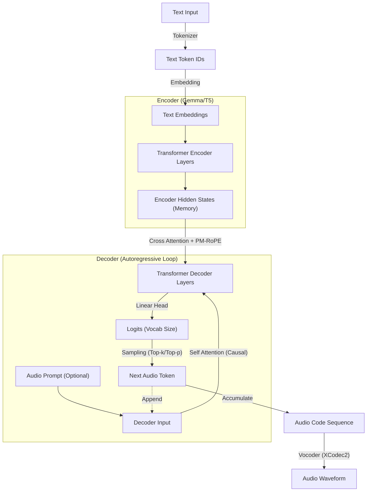

# Tài Liệu Cơ Chế Inference của T5Gemma-TTS

Tài liệu này giải thích chi tiết về kiến trúc và quy trình inference (tổng hợp tiếng nói) của mô hình **T5Gemma-TTS**.

## 1. Tổng quan Kiến trúc (High-Level Architecture)

**T5Gemma-TTS** là một mô hình **Autoregressive (AR) Transformer** được xây dựng dựa trên backbone **Gemma 2B** (Google) theo kiến trúc Encoder-Decoder (kiểu T5).

Khác với Style-Bert-VITS2 (sinh song song), T5Gemma-TTS sinh ra các token âm thanh một cách **tuần tự** (token-by-token), cho phép nó nắm bắt ngữ cảnh tốt hơn cho các câu dài và phức tạp, nhưng tốc độ sinh sẽ phụ thuộc vào độ dài câu.

Mô hình sử dụng cơ chế **PM-RoPE (Progress-Monitoring Rotary Positional Embeddings)** độc đáo để kiểm soát prosody (ngữ điệu) dựa trên tiến độ câu nói.

### Flowchart Tổng Quát

---

## 2. Quy trình Inference Chi Tiết

Quá trình inference được thực hiện qua các bước chính sau (trong hàm `T5GemmaVoiceModel.inference_tts` và `inference_one_sample`):

### Bước 1: Text Processing & Encoding
**Input:** Raw Text ("Xin chào")
**Output:** Encoder Hidden States (`memory`)

1.  **Normalization**: Chuẩn hóa văn bản, phát hiện ngôn ngữ.
2.  **Tokenization**: Sử dụng `AutoTokenizer` (của Gemma/T5) để chuyển text thành ID.
3.  **Encoding**:
    *   Chạy qua khối Encoder của T5Gemma.
    *   Tạo `encoder_position_ids` (nếu dùng PM-RoPE).

> **Ví dụ Minh Họa:**
> *   **Input Text**: "Hello" 
> *   **Tokens**: `[101, 7592, 102]` (Start, Hello, End). Shape `[1, 3]`.
> *   **Embedding**: Tensor `[1, 3, 2048]` (2048 là hidden dimension của Gemma 2B).
> *   **Encoder Output (`memory`)**: Tensor `[1, 3, 2048]`. Đây là "bộ nhớ" chứa ngữ nghĩa câu văn mà Decoder sẽ luôn nhìn vào.

### Bước 2: Duration Estimation & Decoder Prep
**Input:** Text Length / Audio Prompt
**Output:** `est_total` (Ước lượng tổng số token âm thanh sẽ sinh).

Mô hình cần biết "đích đến" ở đâu để tính toán tiến độ (Progress).
*   Công thức ước lượng (ví dụ): `len(text) * 5 + len(prompt)`.
*   Variable `est_total`: Ví dụ ước tính câu nói sẽ dài 150 token âm thanh (frames).

### Bước 3: Autoregressive Generation Loop
**Module:** `Decoder` (`decoder_module`) & `PMCrossAttention`

Đây là vòng lặp chính. Tại mỗi bước $t$:

1.  **Calculate Position ($pos\_id$)**:
    *   Tính vị trí hiện tại dựa trên tiến độ hoàn thành.
    *   Công thức: $pos\_id_t = \frac{t}{\text{est\_total}} \times \text{scale}$
    *   *Ví dụ:* Tại bước t=75 (một nửa câu), `est_total`=150 $\rightarrow$ $pos\_id \approx 0.5 \times 2000 = 1000$.
    *   Điều này báo cho mô hình biết: "Chúng ta đang ở giữa câu".

2.  **Decoder Forward**:
    *   Input: Token âm thanh vừa sinh ra ở bước $t-1$. Shape `[1, 1]`.
    *   **KV Cache (`past_key_values`)**: Tái sử dụng tính toán của các bước trước $0 \to t-1$, chỉ tính toán cho token mới.
    *   **Cross Attention**: Decoder (Query) "nhìn" vào Encoder (Key/Value) kết hợp với `PM-RoPE`.
        *   Query được xoay (rotate) theo $pos\_id$ của Decoder.
        *   Key của Encoder được xoay theo $pos\_id$ của Encoder.

3.  **Logit Prediction**:
    *   Output `[1, 1, 2048]` đi qua `predict_layer` (Linear).
    *   Output Logits: `[1, 1, 65536]` (với Vocab size ~65k của Codec).

4.  **Sampling**:
    *   **Repetition Penalty**: Nếu mô hình bị lặp (ví dụ cứ sinh im lặng mãi), giảm điểm số của token đó.
    *   **Top-k / Top-p**: Chỉ lấy xác suất của 30 token cao nhất (Top-k=30) hoặc tổng xác suất 0.9 (Top-p=0.9).
    *   Chọn ra token tiếp theo: `token_t`.

> **Ví dụ Minh Họa (Bước t=1):**
> *   **Input**: Start Token `<s>`.
> *   **Context**: Encoder Memory `[1, 3, 2048]`.
> *   **Output Logits**: Vector xác suất trên 65k từ vựng.
> *   **Sampled Token**: `4215` (âm thanh đầu tiên của từ "H").

### Bước 4: Completion & Audio Decoding
Quá trình lặp lại cho đến khi gặp token kết thúc (`EOS`) hoặc đạt giới hạn độ dài.

**Input:** Chuỗi token âm thanh `[4215, 332, 1102, ..., 55]` (Shape: `[1, 150]`).
**Output:** Waveform Audio.

1.  **De-quantization/Decoding**: Chuỗi token được đưa vào **Audio Tokenizer (XCodec2)**.
2.  **Vocoder**: Biến đổi các vector code này thành sóng âm thanh liên tục (PCM Waveform).

---

## 3. Các Công Thức Toán Học Chính

### 3.1. Progress-Monitoring Position (PM-RoPE)
Khác với vị trí tuyệt đối (1, 2, 3...), PM-RoPE dùng vị trí tương đối:

$$
\text{pos}(t) = \text{clamp}\left(\frac{t}{T_{est}} \times S, 0, S\right)
$$
*   $t$: Số bước hiện tại (current frame index).
*   $T_{est}$: Tổng độ dài dự kiến (estimated total length).
*   $S$: Thang đo (`progress_scale`, thường là 2000 hoặc 4000).

### 3.2. Cross Attention with PM-RoPE
$$
Attention(Q, K, V) = \text{softmax}\left(\frac{f_{rot}(Q, pos_{dec}) \cdot f_{rot}(K, pos_{enc})^T}{\sqrt{d_k}}\right) V
$$
*   $Q$: Query từ Decoder (đang sinh âm thanh).
*   $K$: Key từ Encoder (văn bản đầu vào).
*   $f_{rot}$: Hàm xoay Rotary Embedding, nhưng dùng `pos` tính theo tiến độ chứ không phải index.
*   Điều này giúp cơ chế Attention "khớp" được âm thanh dài với văn bản ngắn một cách linh hoạt.

---

## 4. Mapping với Code (`models/t5gemma.py`)

| Thành phần | Class/Function (Code) | Vai trò |
| :--- | :--- | :--- |
| **Model Wrapper** | `T5GemmaVoiceModel` | Class chính chứa toàn bộ logic. |
| **Inference Loop** | `inference_tts()` | Hàm thực hiện vòng lặp sinh token tuần tự. |
| **PM-RoPE Logic** | `_build_position_ids()` | Tính toán tensor vị trí dựa trên tỷ lệ $. |
| **Encoder** | `self.encoder_module` | T5Gemma Encoder (xử lý text). |
| **Decoder Layer** | `PMDecoderLayer` | Layer Decoder được tiêm (inject) PM-RoPE. |
| **Cross Attention** | `PMCrossAttention` | Nơi thực hiện phép nhân Query-Key với RoPE xoay theo tiến độ. |
| **Predict Head** | `self.predict_layer` | Linear layer cuối cùng: `Hidden -> Vocab`. |
| **Sampler** | `sample_helper()` | Logic lấy mẫu (Top-k, Temperature, Penalty). |

## 5. So sánh với Style-Bert-VITS2 (Non-AR)

| Đặc điểm | T5Gemma-TTS (AR) | Style-Bert-VITS2 (Non-AR) |
| :--- | :--- | :--- |
| **Cốt lõi** | Transformer (Decoder-only generation). | VAE + Flow + HiFiGAN. |
| **Quy trình** | Sinh từng mã token tuần tự ($t_1 \to t_2 \to \dots$). | Sinh toàn bộ spectrogram một lúc. |
| **Biểu diễn** | Discrete Codes (Token rời rạc, giống từ). | Continuous Spectrogram (Phổ liên tục). |
| **Duration** | Tự động quyết định khi nào dừng (EOS). | Cần `Duration Predictor` dự đoán trước độ dài mỗi từ. |
| **Ưu điểm** | - "Hiểu" ngữ cảnh rộng tốt hơn. - Zero-shot cloning cực tốt (chỉ cần nối prompt). | - Tốc độ cực nhanh. - Ổn định, khó bị lặp lại vô tận. |
| **Nhược điểm** | - Tốc độ chậm hơn (do lặp). - Có thể bị hallucination (nói nhảm) nếu không tune kỹ. | - Khó clone giọng lạ nếu không fine-tune. - Ngữ điệu có thể ít tự nhiên hơn với câu rất dài. |
