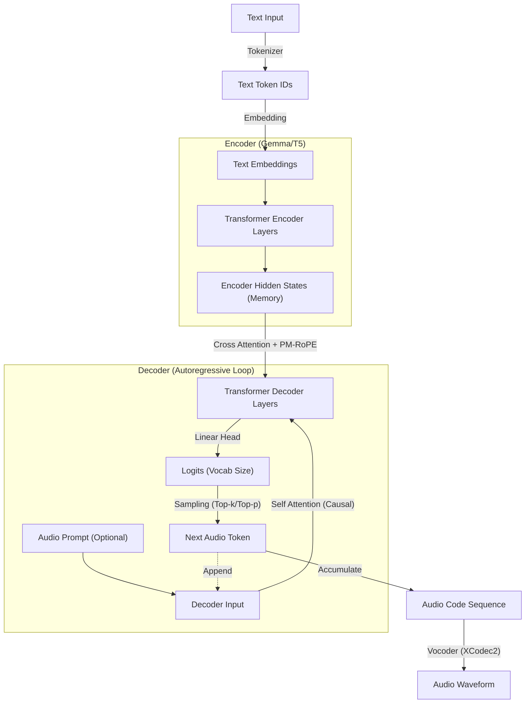

# Tài Liệu Cơ Chế Inference của T5Gemma-TTS

Tài liệu này giải thích chi tiết về kiến trúc và quy trình inference (tổng hợp tiếng nói) của mô hình **T5Gemma-TTS**.

## 1. Tổng quan Kiến trúc (High-Level Architecture)

**T5Gemma-TTS** là một mô hình **Autoregressive (AR) Transformer** được xây dựng dựa trên backbone **Gemma 2B** (Google) theo kiến trúc Encoder-Decoder (kiểu T5).

Khác với Style-Bert-VITS2 (sinh song song), T5Gemma-TTS sinh ra các token âm thanh một cách **tuần tự** (token-by-token), cho phép nó nắm bắt ngữ cảnh tốt hơn cho các câu dài và phức tạp.

Mô hình sử dụng cơ chế **PM-RoPE (Progress-Monitoring Rotary Positional Embeddings)** độc đáo để kiểm soát prosody (ngữ điệu) dựa trên tiến độ câu nói.

### Flowchart Tổng Quát

---

## 2. Quy trình Inference Chi Tiết

Quá trình inference được thực hiện qua các bước chính sau:

### Bước 1: Text Processing & Encoding
**Input:** Raw Text ("Xin chào")
**Output:** Encoder Hidden States (`memory`)

1.  **Normalization**: Chuẩn hóa văn bản, phát hiện ngôn ngữ.
2.  **Tokenization**: Sử dụng `AutoTokenizer` (của Gemma/T5) để chuyển text thành ID.
3.  **Encoding**:
    *   Chạy qua khối Encoder của T5Gemma.
    *   Tạo `encoder_position_ids` (nếu dùng PM-RoPE).

> **Ví dụ Minh Họa:**
> *   **Input Text**: "Hello" 
> *   **Tokens**: `[101, 7592, 102]` (Start, Hello, End). Shape `[1, 3]`.
> *   **Encoder Output (`memory`)**: Tensor `[1, 3, 2048]`. Đây là "bộ nhớ" chứa ngữ nghĩa câu văn mà Decoder sẽ luôn nhìn vào.

### Bước 2: Duration Estimation & Decoder Prep
**Input:** Text Length / Audio Prompt
**Output:** `est_total` (Ước lượng tổng số token âm thanh sẽ sinh).

Mô hình cần biết "đích đến" ở đâu để tính toán tiến độ (Progress).
*   Công thức ước lượng (ví dụ): `len(text) * 5 + len(prompt)`.
*   Variable `est_total`: Ví dụ ước tính câu nói sẽ dài 150 token âm thanh (frames).

### Bước 3: Autoregressive Generation Loop (Vòng lặp sinh tuần tự)
**Module:** `Decoder` (`decoder_module`) & `PMCrossAttention`

Đây là trái tim của mô hình, nơi âm thanh được sinh ra từng đơn vị nhỏ (token) nối tiếp nhau. Quá trình này diễn ra trong một vòng lặp từ bước $t=0$ đến $t=T_{max}$.

**1. Khởi tạo (Initialization):**
*   **Start Token:** Bắt đầu bằng token `<s>` (Start of Sentence).
*   **KV Cache:** Khởi tạo rỗng để lưu trữ các tính toán quá khứ (Key/Value states), giúp tăng tốc độ inference.

**2. Trong mỗi bước lặp (At step $t$):**
   *   **a. Tính toán Vị trí (Position Calculation):**
       *   Tính $pos_id_t$ dựa trên tiến độ hoàn thành: $pos_id_t = \frac{t}{\text{est\_total}} \times \text{scale}$.
       *   Điều này báo cho mô hình biết "chúng ta đang ở đâu trong câu nói" (đầu, giữa, hay cuối) để điều chỉnh ngữ điệu.
   
   *   **b. Decoder Forward:**
       *   Token hiện tại đi qua các lớp Transformer Decoder.
       *   **Cross Attention:** Decoder "nhìn" vào Encoder Memory. Tại đây, **PM-RoPE** xoay vector query/key để đảm bảo Decoder chỉ chú ý vào các từ ngữ tương ứng với tiến độ thời gian hiện tại.

   *   **c. Dự đoán & Lấy mẫu (Predict & Sample):**
       *   Output đi qua lớp Linear (`predict_layer`) -> Logits (xác suất trên 65,536 từ vựng codec).
       *   Áp dụng **Top-k, Top-p, Temperature** và **Repetition Penalty** (chống lặp).
       *   Chọn ra **một** token ID duy nhất cho bước $t$.

   *   **d. Cập nhật (Update):**
       *   Token mới được thêm vào chuỗi kết quả và trở thành Input cho bước $t+1$.

**3. Điều kiện dừng:**
*   Gặp token kết thúc (`EOS`).
*   Hoặc đạt độ dài tối đa (`max_new_tokens`).

### Bước 4: Vocoder Decoding (XCodec2)
**Module:** `AudioTokenizer` (chứa XCodec2 model)

Sau khi vòng lặp kết thúc, ta có chuỗi token âm thanh (Discrete Codes). Bước này chuyển đổi chúng thành sóng âm thanh nghe được.

1.  **Codebook Lookup**: Mỗi token ID được tra cứu trong từ điển (Codebook) để lấy ra vector đặc trưng tương ứng.
2.  **Decoding**: Mô hình XCodec2 (gồm các lớp Conv1d Transposed và Residual Blocks) giải nén các vector này thành Waveform.

> **Lưu ý quan trọng về XCodec2:**
> *   Đây là một mô hình độc lập, hoạt động như "cái miệng" (The Mouth).
> *   Trong quá trình huấn luyện T5Gemma, XCodec2 bị **đóng băng (Frozen)**, không tính gradient. T5Gemma chỉ học cách chọn đúng mã số mà XCodec2 hiểu.

---

## 3. Cơ chế cốt lõi: PM-RoPE (Progress-Monitoring RoPE)

### 3.1. Tại sao cần PM-RoPE? (Vấn đề Alignment)
Trong các mô hình TTS AR truyền thống, mô hình dễ gặp lỗi:
- **Lặp từ (Repetition):** Nói mãi một từ không dứt.
- **Bỏ từ (Skipping):** Nhảy cóc qua nội dung.
- **Ảo giác (Hallucination):** Sinh âm thanh rác khi mất dấu vị trí.

**PM-RoPE** giải quyết bằng cách ép buộc cơ chế Attention tuân theo một "tiến độ" tuyến tính.

### 3.2. Nguyên lý hoạt động
Khác với vị trí đếm số nguyên (1, 2, 3...), PM-RoPE sử dụng **Vị trí dựa trên tiến độ**:

1.  **Text Position:** Các token văn bản được gán vị trí trải đều trên thang đo $S$.
2.  **Audio Position:** Tại bước thứ $t$, vị trí không phải là $t$, mà là vị trí quy đổi tương ứng với **% hoàn thành câu nói**.

### 3.3. Công Thức & Minh Họa
$$ 
\text{pos}(t) = \text{clamp}\left(\frac{t}{T_{est}} \times S, 0, S\right) 
$$ 

**Minh họa trực quan:**
Hãy tưởng tượng thanh trượt nhạc (seek bar) dài 100cm ($S$).
- Văn bản được rải đều trên thanh thước này.
- Khi đầu kim chạy đến vạch 50cm (50% thời gian), nó bắt buộc phải đọc chữ cái nằm ở vạch 50cm. Nó không thể đọc chữ ở vạch 10cm (lặp lại) hay 90cm (nhảy cóc) do góc xoay của RoPE sẽ làm triệt tiêu sự chú ý ở các vùng đó.

---

## 4. Mapping với Code (`models/t5gemma.py`)

| Thành phần | Class/Function (Code) | Vai trò |
| :--- | :--- | :--- |
| **Model Wrapper** | `T5GemmaVoiceModel` | Class chính chứa toàn bộ logic. |
| **Inference Loop** | `inference_tts()` | Hàm thực hiện vòng lặp sinh token tuần tự (Bước 3). |
| **PM-RoPE Logic** | `_build_position_ids()` | Tính toán tensor vị trí dựa trên tỷ lệ. |
| **Encoder** | `self.encoder_module` | T5Gemma Encoder (xử lý text). |
| **Cross Attention** | `PMCrossAttention` | Nơi thực hiện phép nhân Query-Key với RoPE xoay theo tiến độ. |
| **Vocoder** | `data/tokenizer.py` | Wrapper gọi model XCodec2 bên ngoài để decode audio. |

## 5. So sánh với Style-Bert-VITS2 (Non-AR)

| Đặc điểm | T5Gemma-TTS (AR) | Style-Bert-VITS2 (Non-AR) |
| :--- | :--- | :--- |
| **Cốt lõi** | Transformer (Decoder-only generation). | VAE + Flow + HiFiGAN. |
| **Quy trình** | Sinh từng mã token tuần tự. | Sinh toàn bộ spectrogram một lúc. |
| **Biểu diễn** | Discrete Codes (Token rời rạc, giống từ). | Continuous Spectrogram (Phổ liên tục). |
| **Vocoder** | Tách rời (XCodec2), frozen khi train. | Tích hợp (HiFiGAN), train cùng lúc (End-to-End). |
| **Ưu điểm** | "Hiểu" ngữ cảnh rộng, Zero-shot cloning tốt. | Tốc độ cực nhanh, ổn định. |
| **Nhược điểm** | Tốc độ chậm hơn (do vòng lặp). | Khó clone giọng lạ nếu không fine-tune. |